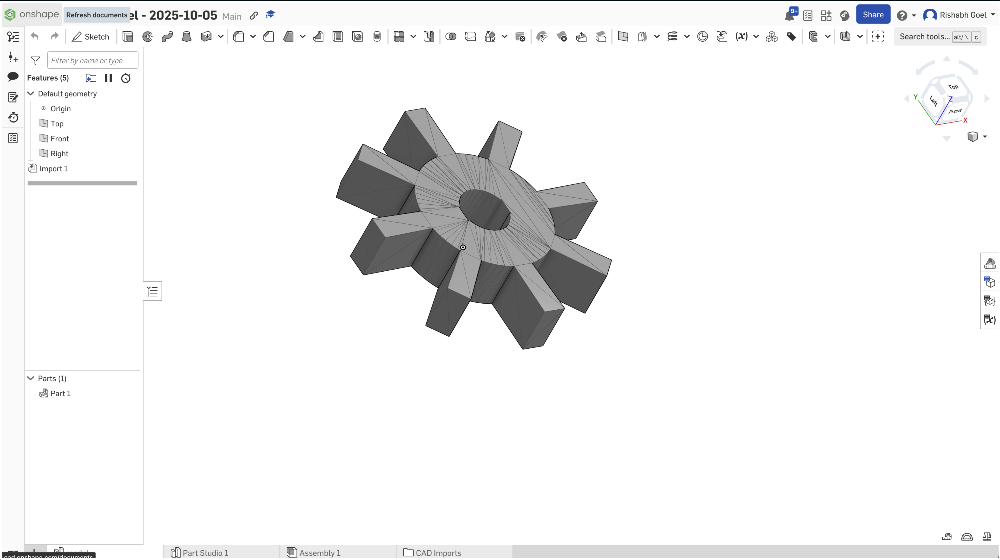
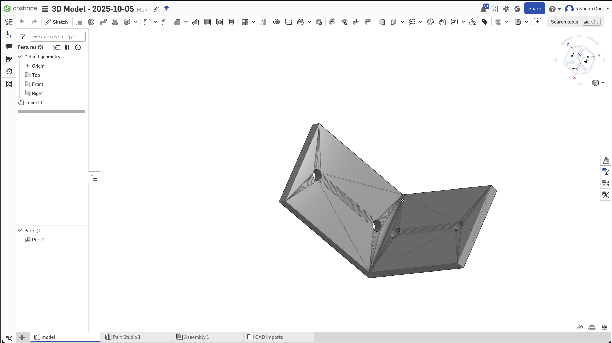

# VibeCAD

## Project Overview and Examples

CAD design is especially intimidating for beginners. Complex software, steep learning curves, and countless constraints can discourage early learners and innovators. 

That's why I made VibeCAD. VibeCAD is a text to CAD platform that integrates directly with OnShape, a popular cloud-based CADing software with over 3 million users. Here, I use CloudFlare workers and agents to create an AI agent that can create CADs for you just from a text input and export them directly to your OnShape account. 

VibeCAD lowers the barrier to entry by:
- Converting simple text prompts into editable CAD models
- Automating repetitive design steps with AI-driven precision
- Providing a web-based interface that’s modern, responsive, and open-source
- Enabling instant iteration, letting users refine models with natural feedback loops (“make it taller,” “add holes,” “round the edges”)

Below are some examples of what I was able to generate:

<div align="center">
  <table>
    <tr>
      <td width="50%">
        
      </td>
      <td width="50%">
        
      </td>
    </tr>
  </table>
</div>

## Background
This project began as a hackathon prototype exploring AI-assisted 3D modeling with OpenSCAD and Onshape.  
You can find the original submission on [Devpost](https://devpost.com/software/vibecad-o4wkbm).

It has since been refactored into a Cloudflare-native implementation using Workers, Durable Objects,
and the Cloudflare Agents framework for orchestration.

## Project Structure

This project consists of three main components:

- **Backend** (`/backend`): FastAPI server for OnShape API integration and OpenSCAD conversion
- **Cloudflare Agent** (`/cloudflare-agent`): Cloudflare Workers AI agent using Anthropic Claude
- **Frontend** (`/frontend`): Next.js web application

## Getting Started

### Prerequisites

Before you begin, ensure you have the following installed on your system:

- **Python 3.8+** ([Download](https://www.python.org/downloads/))
- **Node.js 18+** ([Download](https://nodejs.org/))
- **pnpm** (Package manager for Node.js)
- **OpenSCAD** (Required for 3D model conversion)

#### Installing OpenSCAD

**macOS:**
```bash
brew install openscad
```

**Ubuntu/Debian:**
```bash
sudo apt-get update
sudo apt-get install openscad
```

**Windows:**
Download from [https://openscad.org/downloads.html](https://openscad.org/downloads.html)

#### Installing pnpm

```bash
npm install -g pnpm
```

---

## Backend Setup

### 1. Navigate to the backend directory

```bash
cd backend
```

### 2. Create a Python virtual environment

```bash
python3 -m venv env
```

### 3. Activate the virtual environment

**macOS/Linux:**
```bash
source env/bin/activate
```

**Windows:**
```bash
env\Scripts\activate
```

### 4. Install Python dependencies

```bash
pip install -r requirements.txt
```

### 5. Configure environment variables

Create a `.env` file in the `backend` directory:

```bash
touch .env
```

Add the following environment variables to the `.env` file:

```env
ONSHAPE_ACCESS_KEY=your_onshape_access_key_here
ONSHAPE_SECRET_KEY=your_onshape_secret_key_here
ONSHAPE_API_URL=https://cad.onshape.com/api/v12
```

> **Note:** You'll need to obtain OnShape API credentials from your OnShape account settings. Your account must be a paid account or an education account. You can find your API keys [here](https://cad.onshape.com/user/developer/apiKeys)

### 6. Run the backend server

```bash
uvicorn app:app --host 0.0.0.0 --port 8000
```

The backend API will be available at `http://localhost:8000`

---

## Cloudflare Agent Setup

### 1. Navigate to the cloudflare-agent directory

```bash
cd cloudflare-agent
```

### 2. Install Node.js dependencies

```bash
npm install
```

### 3. Configure environment variables

Create a `.dev.vars` file in the `cloudflare-agent` directory:

```bash
touch .dev.vars
```

Add your Anthropic API key to the `.dev.vars` file:

```env
ANTHROPIC_API_KEY=your_anthropic_api_key_here
```

> **Note:** You'll need to obtain an Anthropic API key from [https://console.anthropic.com/](https://console.anthropic.com/)

### 4. Run the Cloudflare Worker locally

```bash
npx wrangler types
npx wrangler dev
```

The Cloudflare Worker will be available at `http://localhost:3001`

## Frontend Setup

### 1. Navigate to the frontend directory

```bash
cd frontend
```

### 2. Install pnpm (if not already installed)

```bash
npm install -g pnpm
```

### 3. Install dependencies using pnpm

```bash
pnpm install
```

### 4. Run the development server

```bash
pnpm dev
```

The frontend application will be available at `http://localhost:3000`

## Running All Services

To run the entire application, you'll need to start all three services in separate terminal windows:

**Terminal 1 - Backend:**
```bash
cd backend
source env/bin/activate  # or env\Scripts\activate on Windows
uvicorn app:app --host 0.0.0.0 --port 8000
```

**Terminal 2 - Cloudflare Agent:**
```bash
cd cloudflare-agent
npx wrangler dev
```

**Terminal 3 - Frontend:**
```bash
cd frontend
pnpm dev
```

---

## Environment Variables Summary

### Backend (`.env`)
- `ONSHAPE_ACCESS_KEY`: Your OnShape API access key
- `ONSHAPE_SECRET_KEY`: Your OnShape API secret key 
- `ONSHAPE_API_URL`: OnShape API URL (default: `https://cad.onshape.com/api/v12`)

### Cloudflare Agent (`.dev.vars`)
- `ANTHROPIC_API_KEY`: Your Anthropic Claude API key

### Frontend
- No environment variables required by default
- Add any required API URLs if needed

---

## Troubleshooting

### Backend Issues

**OpenSCAD not found:**
- Ensure OpenSCAD is installed and available in your system PATH
- Test by running `openscad --version` in your terminal

**OnShape API errors:**
- Verify your API credentials are correct
- Check that your OnShape account has API access enabled

### Cloudflare Agent Issues

**Wrangler not found:**
- Install wrangler globally: `npm install -g wrangler`
- Or use npx: `npx wrangler dev`

**Anthropic API errors:**
- Verify your API key is correct and has credits available
- Check the `.dev.vars` file is in the correct location

### Frontend Issues

**pnpm not found:**
- Install pnpm globally: `npm install -g pnpm`

